# Synology Docker Django Postgresql


## 設定Postgresql
首先先到倉庫伺服器收尋postgres
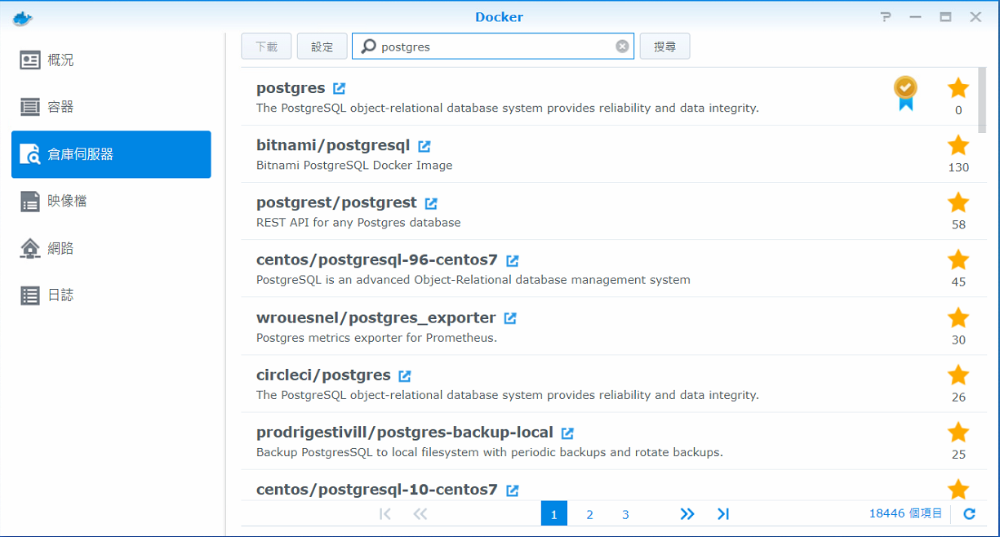

接著再映像檔點postgres新增容器
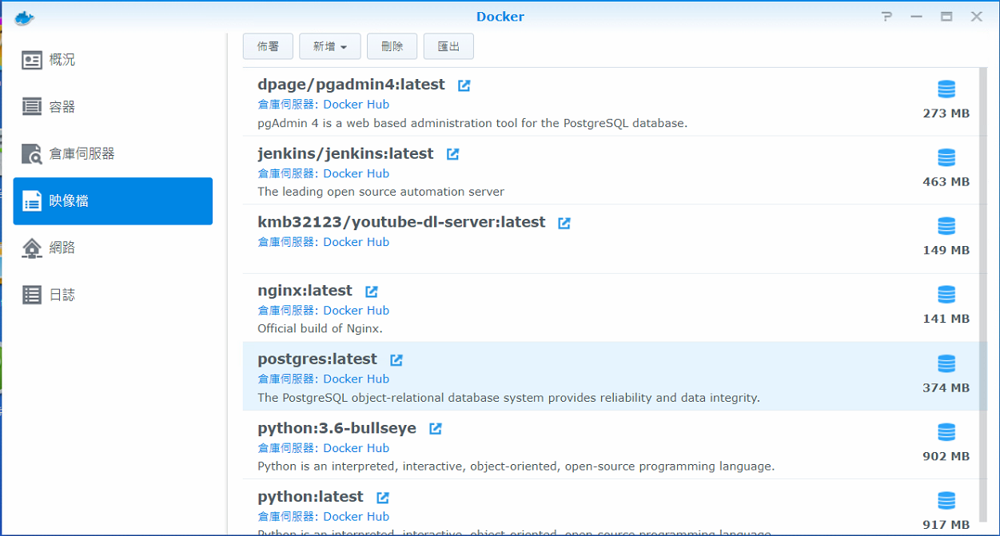


點選進階設定
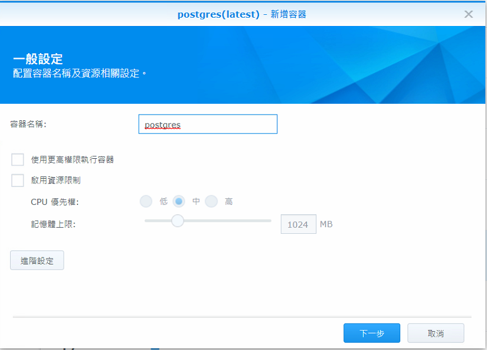


設定port,可自行設定對應的port
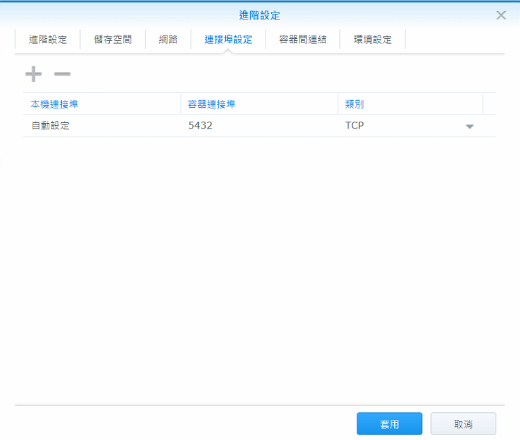


設定環境變數,新增紅色框內的
<ul>
    <li>POSTGRES_USER:設定資料庫使用者名稱</li>
    <li>POSTGRES_PASSWORD:資料庫密碼</li>
    <li>POSTGRES_DB:資料庫名稱</li>
</ul>

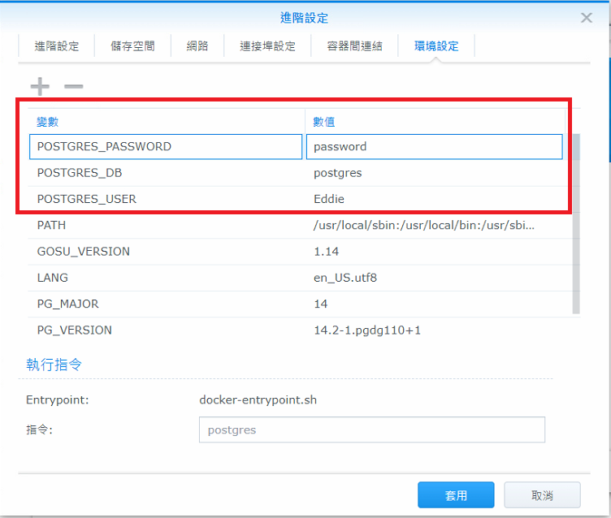


完成後可以去容器那點選查看資訊
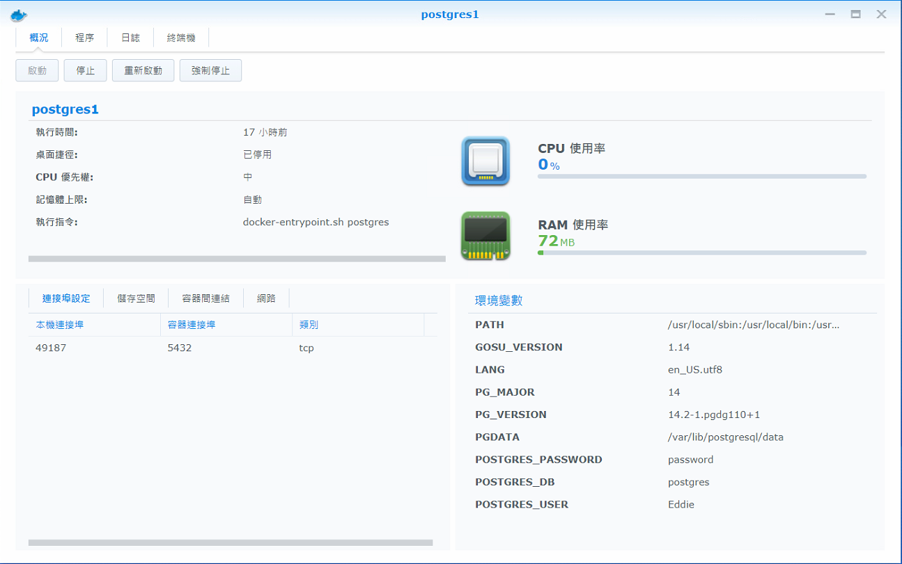

## 設定python

一樣先到收尋python 下載想要的版本,並且點選新增容器


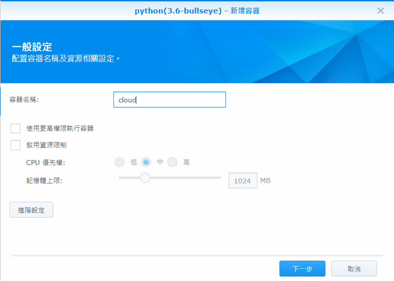


設定儲存空間,掛載路徑,下面就會將docker資料夾底下的東西顯示在/home/
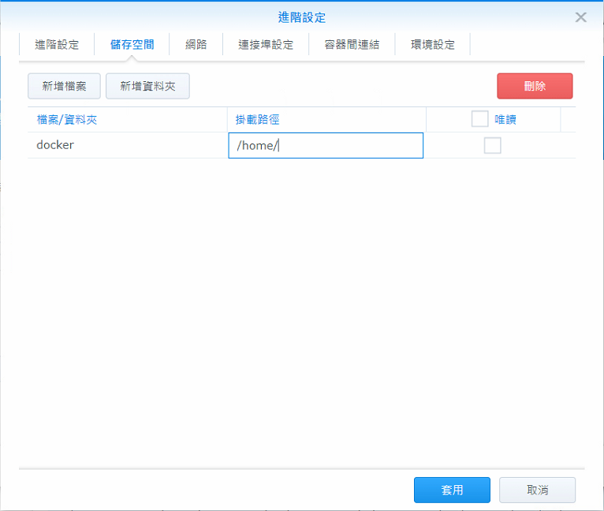

設定port,下面會將docker container 8080port 對應到NAS IP port
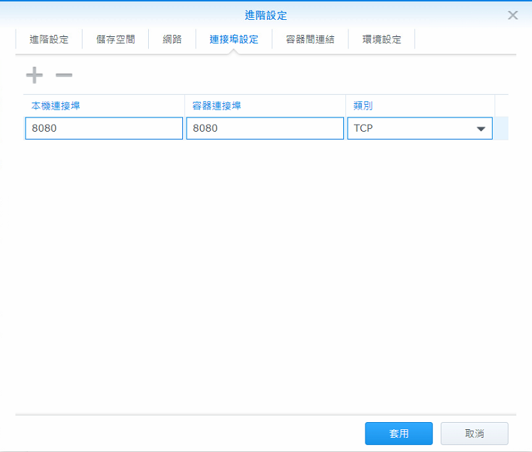


設定容器間連結,這樣設定的好處是當啟動container會連db container也一起啟動
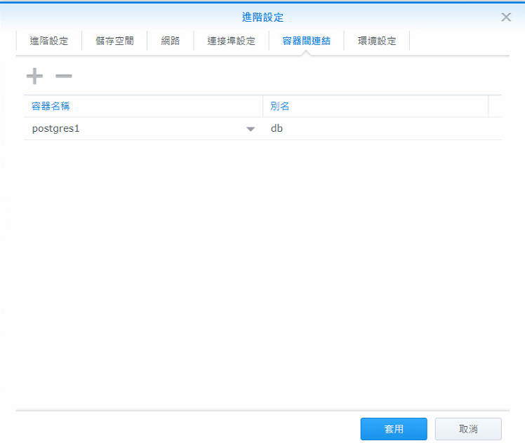


接著去看網路IP
bridge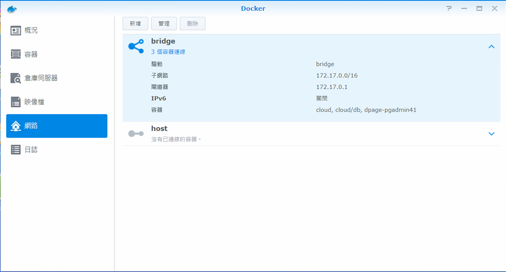


將已經建好的django放置docker資料夾,修改django setting.py,host ip填入剛剛bridge ip,port 填入剛剛db container對外的port
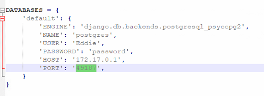

設定完執行
```
python manage.py migrate
```

啟動server,注意這裡使用0.0.0.0,port 為剛剛輸入對應的container port
```
python manage.py runserver 0.0.0.0:8080
```

接著可以上http://your_nas_ip:8080/

## 設定PgAdmin
這是一個可以瀏覽Postgresql的web gui<br>

主要設定port 和環境變數如下
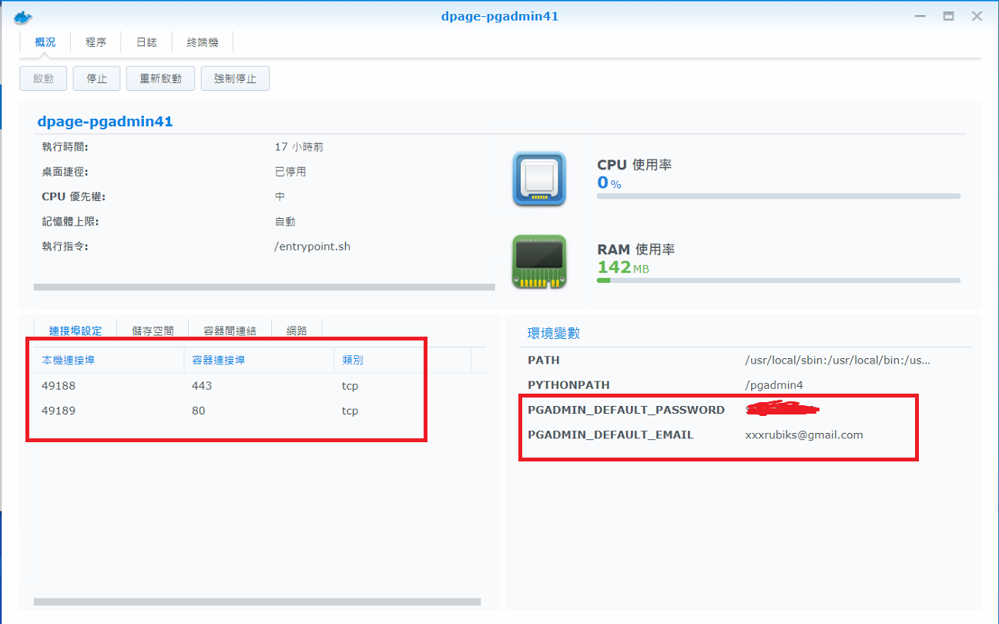


網頁輸入http://your_nas_ip:49189/,輸入環境變數設定的mail和password登入
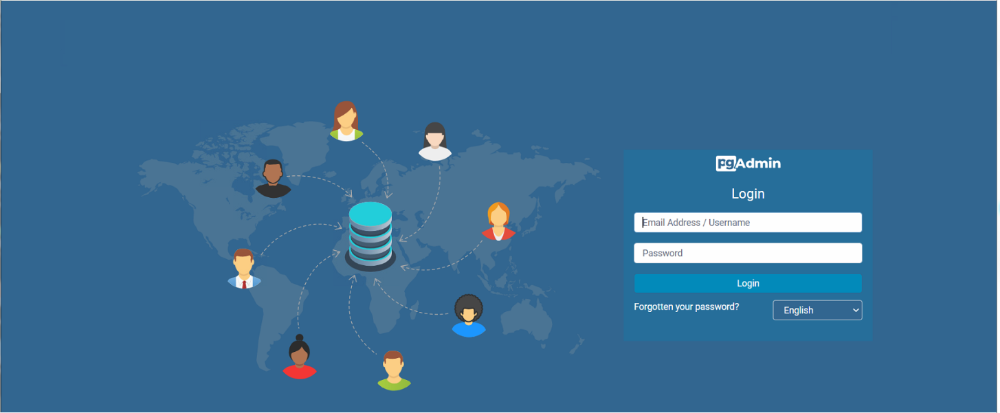


進去後點選servers->create->server 
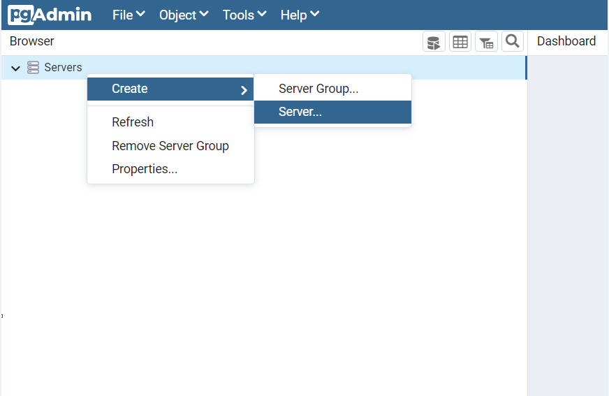


名稱可以隨變輸入<br>
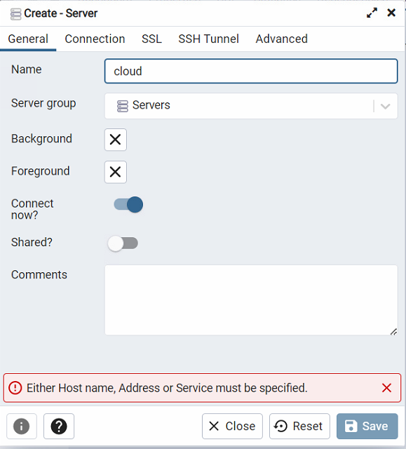


輸入以下資訊<br>
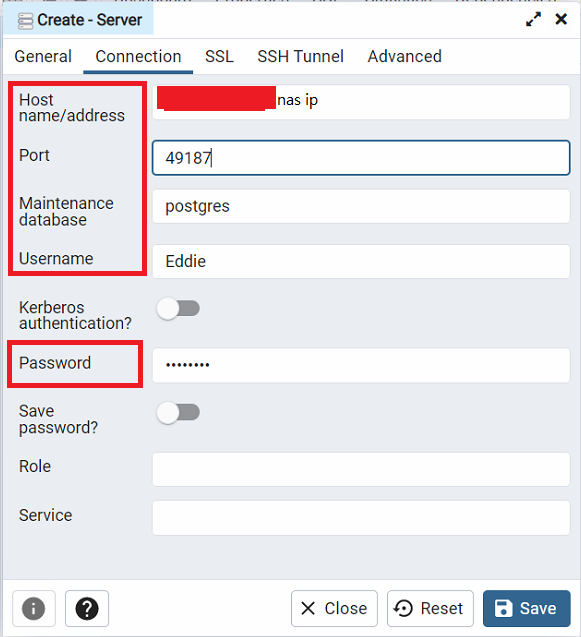


成功連結就會出現下面畫面<br>
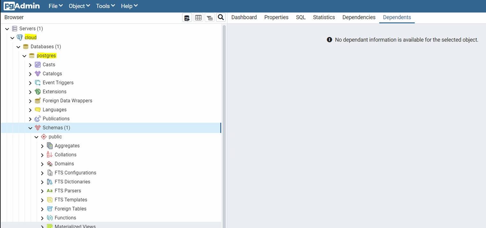


