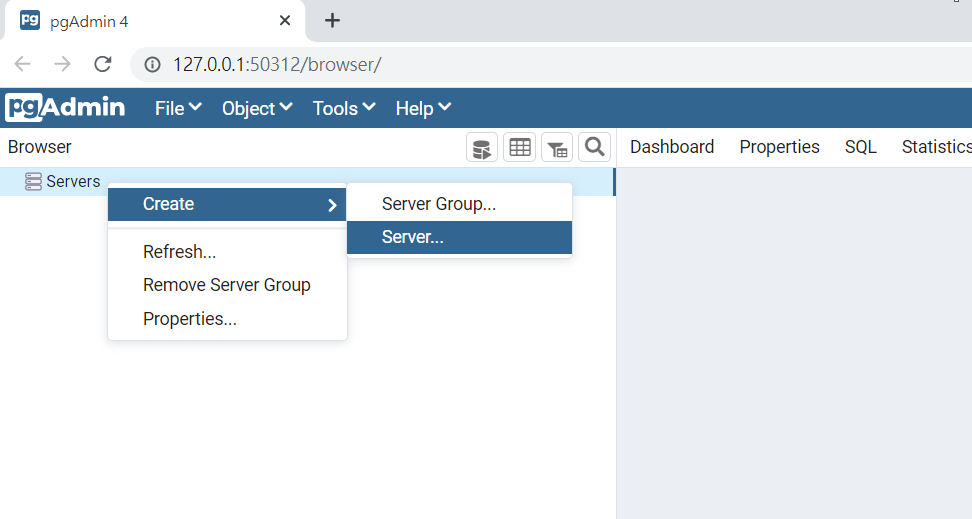
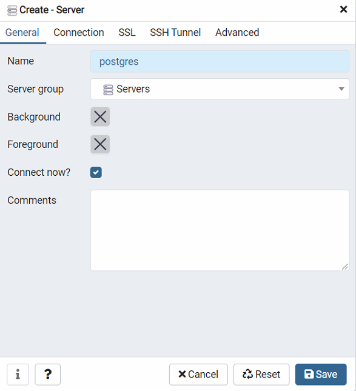
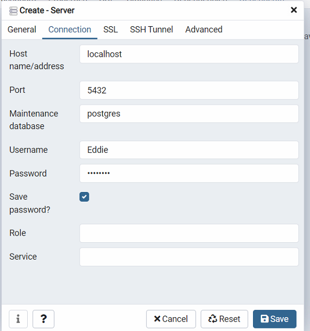

# Constructor environment with Docker

<a href = "https://docs.microsoft.com/zh-tw/learn/modules/use-docker-container-dev-env-vs-code/">參考</a>


## 先建立Django Project

```
django-admin startproject demo
```


## vscode環境設定

開啟vscode 置相對應的資料夾,


### 安裝 Remote - Containers 延伸模組

點選左下角[延伸模組] 圖示,開啟[擴充功能],並輸入remote containers,安裝Remote - Containers


### 加入Container Configuraions Files
鑑入F1,輸入remote-container:add,點選


選python3 & postgresql


完成後會跑出<br>


### 修改devcontainer.json

需要修改的地方如下
<ul>
    <li>database:連接到哪個database</li>
    <li>username:使用者名字</li>
    <li>password:密碼</li>
</ul>


並下在底下註解掉這行,這行指令是當container產生後會執行的指令


requirements.txt<br>


### 修改docker-compose.yml
修改下面需與devcontainer.json對應


### build

鑑入F1,輸入remote-container:repoen,點選,等待它build就完成了,<br>

最後左下角會出現如下


## 測試資料庫是否成功(use pgAdmin4 )

建立server<br>



輸入Name<br>



輸入HostName,db,UserName,Password,需與前面設定一樣<br>



## Django 

###  Set DataBase

demo/demo/settings.py 將database 修改


```python
DATABASES = {
    'default': {
        'ENGINE': 'django.db.backends.postgresql_psycopg2',
        'NAME': 'postgres',
        'USER': 'Eddie',
        'PASSWORD': 'password',
        'HOST': 'localhost',
        'PORT': '',
    }
}

```


執行
```
    python manage.py migrate
```


建立superuser
```
    python manage.py createsuperuser
```


